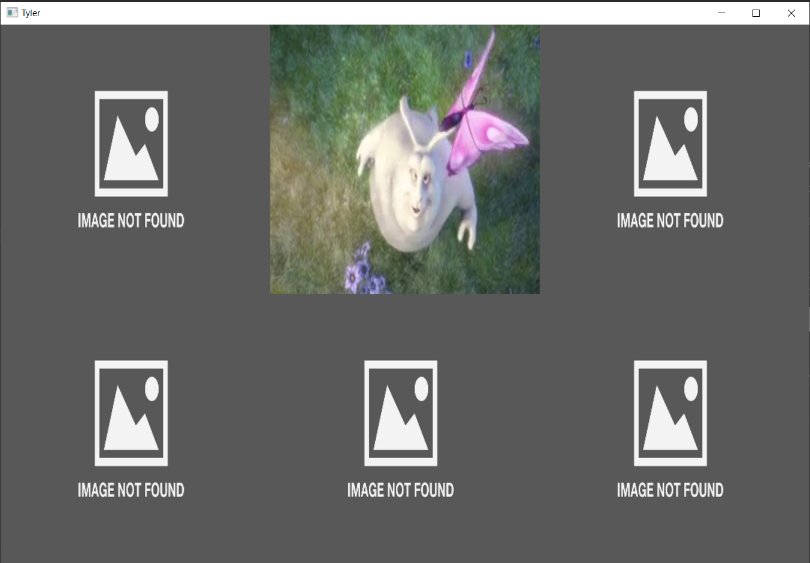
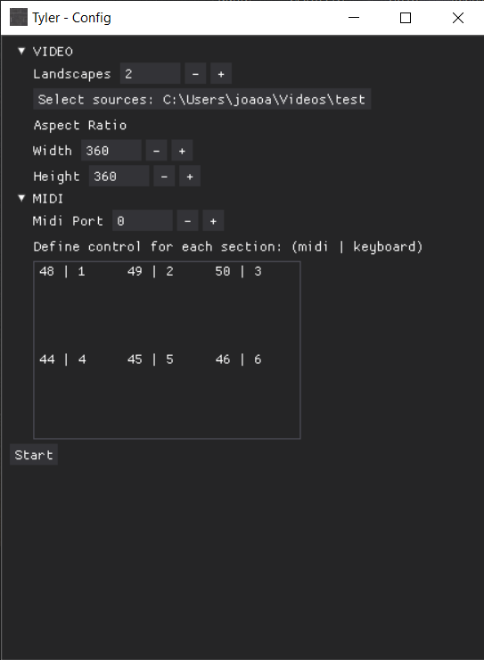

# Tyler

*Tyler* is a simple desktop app for tiling videos on a 3 by 2 grid and controlling transitions via midi input.

## How it works

The basic ideia is cycling through **landscapes** one **section** at a time. 

- **Landscape**: A landscape is a video that takes up the entire window, that is, all sections of the 3 by 2 grid. The idea is to have multiple landscapes that will be queued up in order to be shown on screen.
- **Section**: A section is one part of the grid and it can be controlled independently.

Each section listens to a specific midi or keyboard command and, on receiving it, it switches to the same section on the next landscape on queue. For instance, on starting the presentaton, the grid will be filled with all sections from the first landscape. On receiving a command for the first section (upper left corner), this section will be switched to show the first section (upper left corner) of the second landscape while all other sections remain unchanged.

## The directory structure

To run this application, you are expected to have all landscapes already split into 6 independent videos -- one for each section -- in the same directory, with the following naming pattern: ***landscapeIndex*_*sectionIndex*.mp4**

For example, let's say that we have 3 landscapes. The landscape indexes will be 0, 1 and 2. The section indexes grow from 0 to 5, from left to right and top to bottom.

So, the video for the upper left section on the first landscape must be named **0_0.mp4** while the video named **1_4.mp4** will be displayed on the bottom middle section of the second landscape.

If an expected video is missing from the directory, say the bottom left section of the third landscape (**2_3.mp4**), an *IMAGE NOT FOUND* image will be displayed in its place.

## Configs

When first launching *Tyler* you will be greeted with a window to set some basic configs necessary for running the application.

- Landscapes: The total number of landscapes on queue. Defaults to 6
- Sources: The directory where the videos are.
- Aspect Ratio: The aspect ration of each section. Defaults to 1080 by 1080
- Midi Port: The port number for the midi controller
- Midi and Keyboard controls: Maps each section of the grid to a specific midi note and keyboard key.

Once all the settings are to your liking, just press start and it should work!

## Dependencies
- DearPyGui 1.7.1
- VidGear 0.2.6
- ffpyplayer 4.3.5
- python-rtmidi 1.4.9
- opencv-python 4.6.0.66
- numpy 1.23.1

## Dist

You can download a working compiled copy from [this link](https://drive.google.com/file/d/1xBR5m4M3QWwWgSxbg1dktXWUWEiNaJnw/view?usp=sharing)